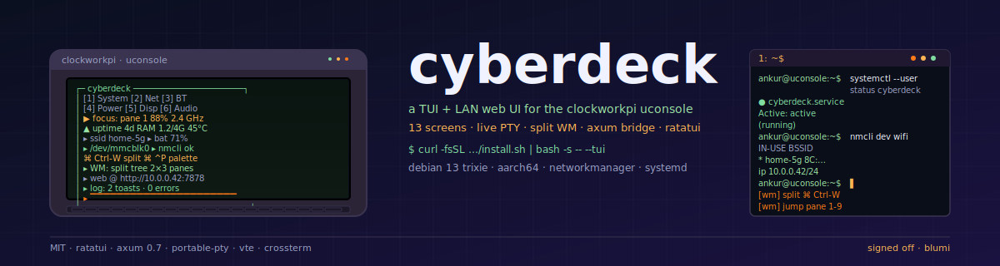

# cyberdeck

<p align="center">
  
</p>

<p align="center">
  <em>A 13-screen ratatui TUI + axum web bridge for the ClockworkPi uconsole.</em><br/>
  <em>City map with braille POI/area rendering, weather icons, GPS marker, AI assistant,</em><br/>
  <em>two-pane WM with live PTY terminals, Wi-Fi radar with human sensing.</em>
</p>

---

## What it is

A rich TUI + LAN web UI for OS-level control of a single-board computer —
designed for the **ClockworkPi uconsole** (aarch64, Debian 13 trixie).

```
+------------------+   +-----------------+   +----------------+
|  cyberdeck-core  |<--|  cyberdeck-tui  |   |  cyberdeck-web |
|  (no TUI/web)    |   |  ratatui front  |<->|  axum HTTP/WS  |
+------------------+   +-----------------+   +----------------+
```

- **`cyberdeck-core`** — async wrappers for `nmcli`, `systemctl`, `apt`, `pactl`, `bluetoothctl`, etc.
- **`cyberdeck-tui`** — 13 screens + city map + AI + command palette + window manager with live terminals.
- **`cyberdeck-web`** — axum 0.7 server (JSON API + WebSocket). Standalone or embedded in the TUI.
- **`wifi-radar`** — passive 802.11 monitor with CSI human sensing and a web UI.

## Quick install

```sh
# TUI only
curl -fsSL https://raw.githubusercontent.com/ankurCES/uconsole-cybertui/main/install/install.sh \
  | bash -s -- --tui

# TUI + web service
curl -fsSL https://raw.githubusercontent.com/ankurCES/uconsole-cybertui/main/install/install.sh \
  | bash -s -- --full
```

See [docs/installation.md](docs/installation.md) for all presets, options, and build-from-source.

## Quick run

```sh
cyberdeck-tui                          # TUI
cyberdeck-tui --web                    # TUI + embedded web (0.0.0.0:7878)
cyberdeck-web 0.0.0.0:7878             # standalone web
cargo run -p wifi-radar -- --dev       # Wi-Fi radar (dev mode)
```

## Documentation

| Document | Contents |
|----------|----------|
| [Installation](docs/installation.md) | One-liner install, presets, options, build from source |
| [Screens & Keymaps](docs/screens.md) | TUI screens, navigation, global keys, WM keys, HTTP API |
| [Configuration](docs/configuration.md) | Privilege model, sudoers, bearer tokens |
| [Development](docs/development.md) | Architecture, hardening, contributing |

## Wiki

| Page | Topic |
|------|-------|
| [Home](docs/wiki/Home.md) | Index |
| [Architecture](docs/wiki/Architecture.md) | Crate map, action flow |
| [Keymaps](docs/wiki/Keymaps.md) | Full per-screen keymap |
| [Hardware / Setup](docs/wiki/Hardware-Setup.md) | uconsole on Debian 13 |
| [WiFi Vitals](docs/wiki/WiFi-Vitals-Nexmon-CM4.md) | CSI human sensing setup |
| [Hardening](docs/wiki/Hardening.md) | No-hang PTY tests |
| [Roadmap](docs/wiki/Roadmap.md) | Phases + follow-ups |

## License

MIT.

---

<p align="center">
  <sub>
    <code>clockworkpi</code> · <code>uconsole</code> · <code>aarch64</code> ·
    <code>rust</code> · <code>ratatui</code> · <code>axum</code> · <code>tui</code>
  </sub>
</p>
